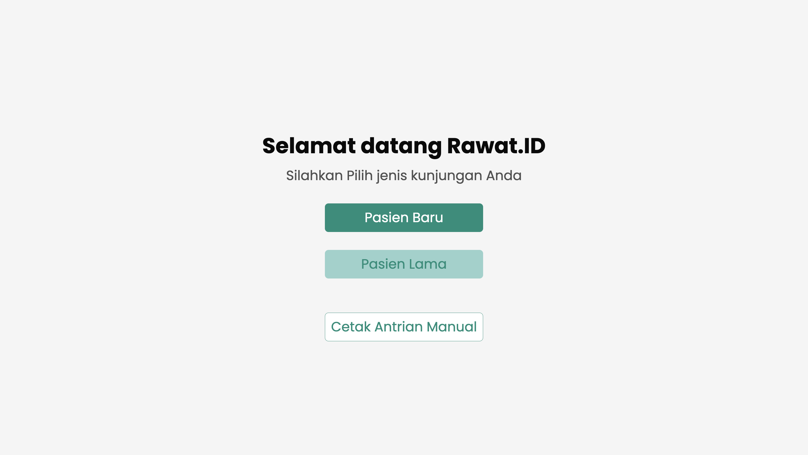
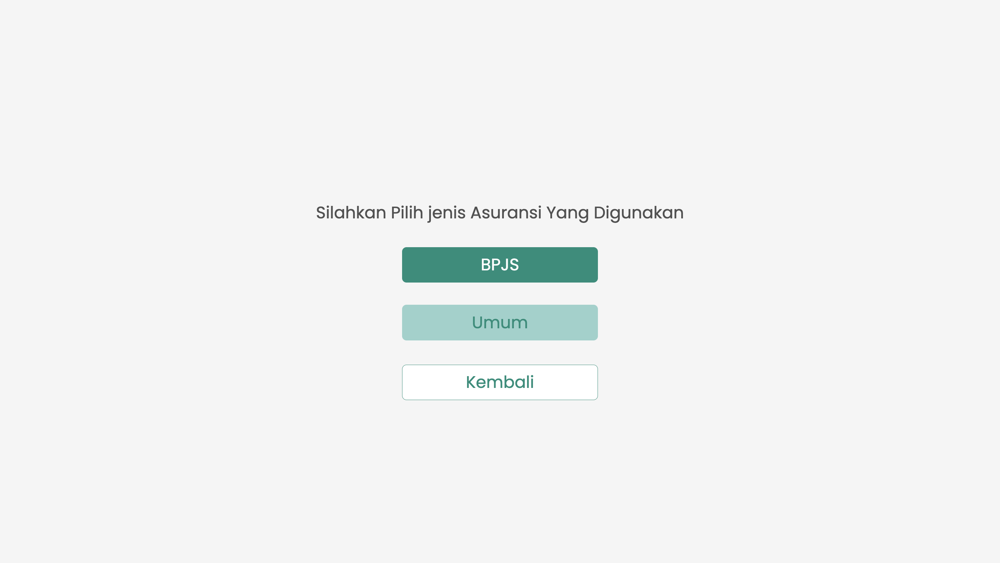
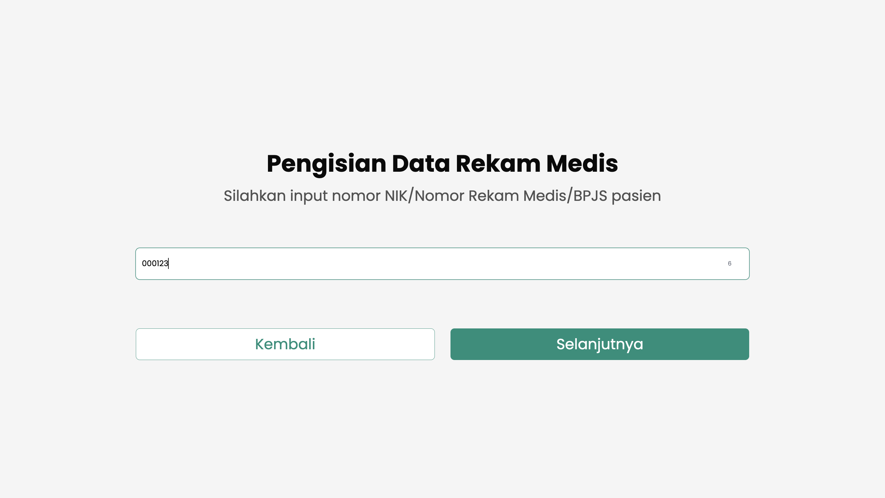
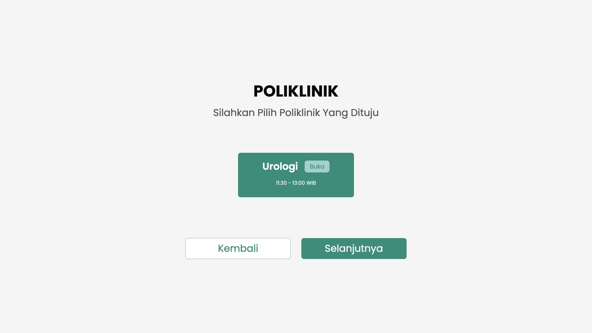
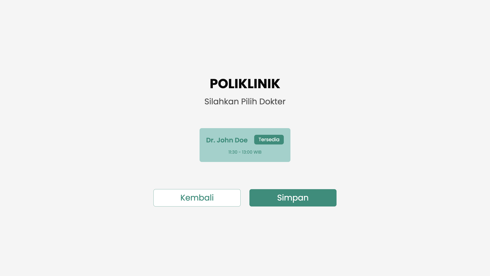
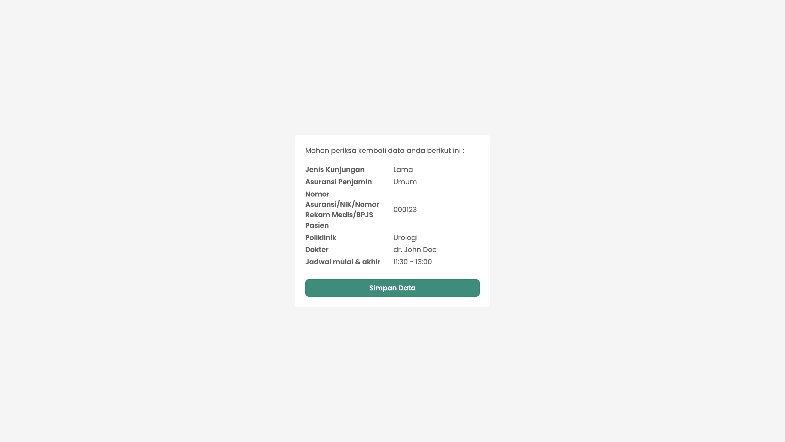
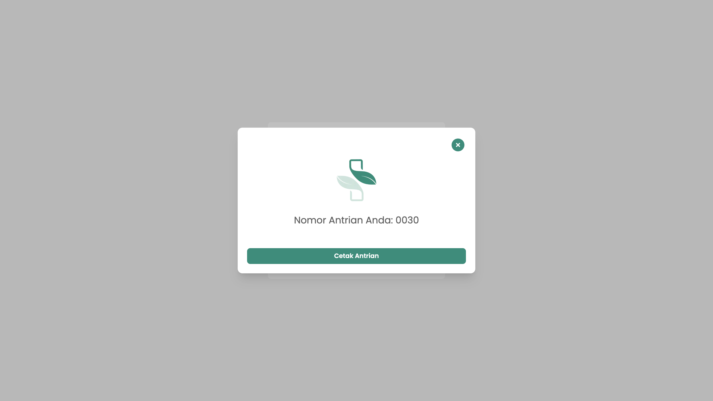
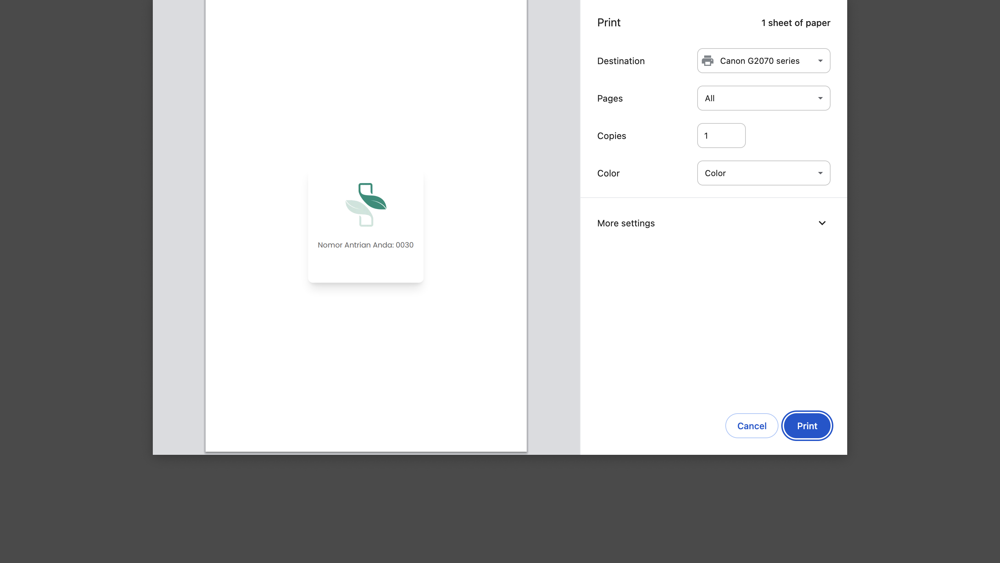
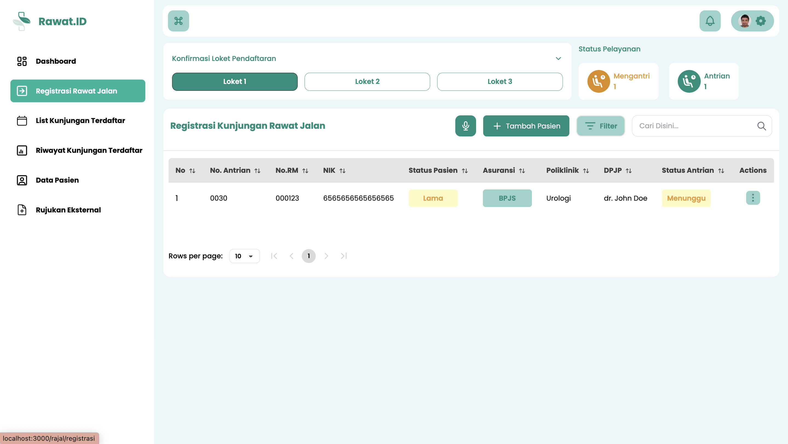

# Antrian dan Registrasi Mandiri via Anjungan (Pasien Lama)

Panduan ini menjelaskan alur registrasi mandiri di mesin anjungan (kiosk) yang ditujukan khusus untuk **pasien lama** (pasien yang sudah memiliki Nomor Rekam Medis/RM).

Proses ini memungkinkan pasien untuk mendaftarkan kunjungannya—memilih poliklinik, dokter, dan jenis pembayaran—secara mandiri. Karena identitas pasien sudah terekam di sistem, proses ini jauh lebih cepat daripada pendaftaran pasien baru.

:::warning Penting: Registrasi Mandiri Tetap Memerlukan Verifikasi
Proses registrasi mandiri di anjungan **Tidak** menggantikan verifikasi oleh petugas. Pasien tetap harus menunggu dipanggil di loket pendaftaran untuk konfirmasi akhir data kunjungan, penjamin (asuransi), dan validasi lainnya sebelum dapat melanjutkan ke poliklinik.
:::

---

## Untuk Petugas: Persiapan Mesin Anjungan

Sebelum pasien dapat menggunakan anjungan, petugas pendaftaran atau IT harus memastikan mesin telah siap.

1.  **Akses Halaman Anjungan:** Buka browser di komputer anjungan dan akses alamat sistem Anda, diikuti dengan `/anjungan`.
    * Contoh: `https://klinikanda.rawat.id/anjungan`
2.  **Pastikan Printer Terhubung:** Pastikan komputer anjungan terhubung ke *thermal printer* (mesin pencetak struk), dalam keadaan menyala, dan memiliki kertas yang cukup.
3.  **Tampilkan Menu Utama:** Setelah halaman dimuat, tampilan menu antrian akan muncul. Mesin kini siap digunakan oleh pasien.

---

## Untuk Pasien: Langkah-Langkah Registrasi Mandiri

Berikut adalah langkah-langkah yang harus diikuti pasien di mesin anjungan.

### 1. Pilih Opsi "Pasien Lama"

Pada layar utama anjungan, ketuk tombol **"Pasien Lama"** untuk memulai alur registrasi bagi pasien yang sudah terdaftar.

### 2. Pilih Jenis Pembayaran

Pilih jenis penjamin atau pembayaran untuk kunjungan ini.
* Pilih **Mandiri/Umum** jika membayar secara pribadi.
* Pilih **Asuransi** jika menggunakan penjamin, lalu tentukan jenis asuransi yang akan dipakai.

### 3. Masukkan Nomor Rekam Medis (RM)

Ketikkan **Nomor Rekam Medis (RM)** Anda yang sudah terdaftar pada kolom yang tersedia, lalu ketuk 'Cari' atau 'Lanjut'.

### 4. Pilih Poliklinik Tujuan

Sistem akan menampilkan daftar poliklinik. Pilih **Poliklinik** yang ingin Anda tuju untuk kunjungan hari ini.

:::info Catatan
Sistem hanya akan menampilkan poliklinik yang memiliki jadwal praktik pada hari tersebut.
:::

### 5. Pilih Dokter Tujuan

Setelah memilih poliklinik, daftar dokter yang praktik di poli tersebut akan muncul. Pilih **Dokter** yang Anda tuju.

:::info Catatan
Hanya dokter yang memiliki jadwal praktik pada hari ini di poliklinik tersebut yang akan ditampilkan.
:::

### 6. Konfirmasi Data Registrasi

Sebuah halaman ringkasan akan muncul, menampilkan data kunjungan Anda (Poli, Dokter, Penjamin). Periksa kembali apakah semua informasi sudah benar.

Jika sudah, ketuk **"Simpan Data"** untuk mengonfirmasi.

### 7. Ambil Nomor Antrian

Registrasi mandiri Anda berhasil. Layar akan menampilkan nomor antrian Anda. Ketuk tombol **"Cetak Antrian"** untuk mencetak struk.

### 8. Konfirmasi Pencetakan

Sebuah jendela *print preview* (tinjauan cetak) dari browser mungkin akan muncul. Ketuk **"Print"** atau **"Cetak"** untuk mengirim data ke mesin pencetak struk.

:::info Langkah Selanjutnya (Pasien)
Harap simpan struk antrian Anda. Silakan menunggu di area yang telah disediakan hingga nomor Anda dipanggil oleh petugas di loket pendaftaran untuk **verifikasi akhir**.
:::

---

## Untuk Petugas: Memantau dan Memverifikasi Pasien

Alur ini akan kembali ke petugas pendaftaran di loket.

### 1. Pantau Antrian Pasien

Pasien yang telah berhasil mendaftar mandiri akan otomatis muncul di daftar antrian pada menu **"Registrasi Rawat Jalan"** di sistem Anda.

### 2. Panggil dan Verifikasi Pasien

Panggil pasien sesuai nomor antrian untuk melakukan konfirmasi dan verifikasi data (terutama kesesuaian data asuransi, surat rujukan jika ada, dll).

:::info Langkah Selanjutnya (Petugas)
Setelah pasien dipanggil dan data diverifikasi, lanjutkan proses registrasi kunjungan seperti biasa. (Lihat panduan **"Registrasi Kunjungan Pasien"** untuk detail lebih lanjut).
:::