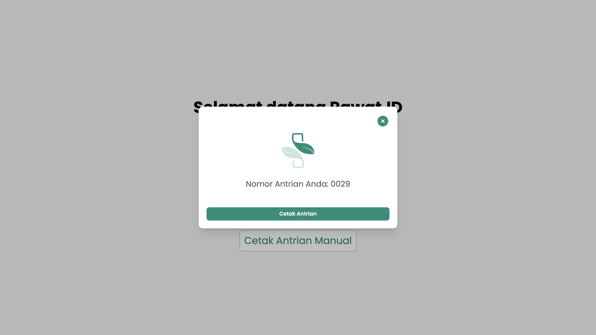
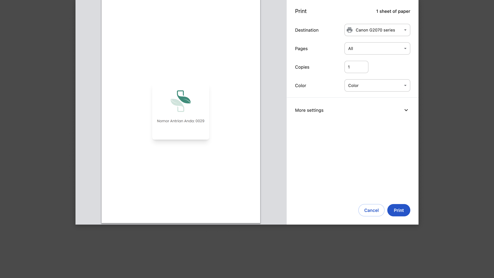

# Pengambilan Nomor Antrian Langsung (Manual)

Panduan ini menjelaskan alur bagi pasien untuk mengambil nomor antrian pendaftaran secara langsung melalui mesin antrian atau mesin anjungan (kiosk).

Proses ini merupakan salah satu mekanisme untuk mengelola alur registrasi kunjungan pasien agar lebih teratur. Pasien yang datang akan mengambil nomor antrian terlebih dahulu dan menunggu untuk dipanggil oleh petugas pendaftaran.

## Kapan Menggunakan Antrian Langsung?

Penting untuk memahami perbedaan antara dua jenis antrian yang mungkin tersedia di fasilitas Anda.

* **1. Antrian Langsung (Manual)**
    Proses ini adalah fokus dari panduan ini. Pasien hanya perlu menekan satu tombol untuk langsung mendapatkan nomor antrian.
    * **Direkomendasikan untuk:** Pasien lanjut usia, pasien dengan keterbatasan (misalnya, kesulitan membaca atau mengoperasikan komputer), atau siapa saja yang membutuhkan proses yang paling sederhana.

* **2. Antrian dengan Registrasi Mandiri**
    Proses ini mengharuskan pasien menginput beberapa informasi data diri (seperti NIK atau nomor rekam medis) secara mandiri di mesin anjungan sebelum mendapatkan nomor antrian.
    * **Direkomendasikan untuk:** Pasien yang mampu mengoperasikan layar sentuh/komputer. Tujuannya adalah untuk mempercepat proses di loket pendaftaran, karena sebagian data sudah diverifikasi oleh pasien.

---

## Untuk Petugas: Persiapan Mesin Anjungan

Sebelum pasien dapat mengambil nomor antrian, petugas pendaftaran atau IT harus memastikan mesin anjungan telah siap digunakan.

1.  **Akses Halaman Anjungan:** Buka browser di komputer anjungan dan akses alamat sistem Anda, diikuti dengan `/anjungan`.
    * Contoh: `https://klinikanda.rawat.id/anjungan`

2.  **Pastikan Printer Terhubung:** Pastikan komputer anjungan telah terhubung dengan *thermal printer* (mesin pencetak struk) dan dalam keadaan menyala serta siap mencetak.

3.  **Tampilkan Menu Utama:** Setelah halaman dimuat, tampilan utama antrian akan muncul. Mesin kini siap digunakan oleh pasien.

---

## Untuk Pasien: Langkah-Langkah Pengambilan Nomor

Berikut adalah langkah-langkah yang dilakukan pasien di mesin anjungan.

### 1. Pilih Opsi "Cetak Antrian Manual"

Pada layar utama anjungan, pasien hanya perlu mengetuk tombol **"Cetak Antrian Manual"**.

### 2. Dapatkan Nomor Antrian

Sistem akan secara otomatis menghasilkan nomor antrian baru dan menampilkannya di layar.

### 3. Cetak Nomor Antrian

1.  Untuk mencetak bukti fisik, ketuk tombol **"Cetak"**.
2.  Mesin printer akan otomatis mengeluarkan struk berisi nomor antrian Anda.

:::info Langkah Selanjutnya
Setelah mendapatkan nomor antrian, silakan menunggu di area yang telah disediakan hingga nomor Anda dipanggil oleh petugas di loket pendaftaran.
:::