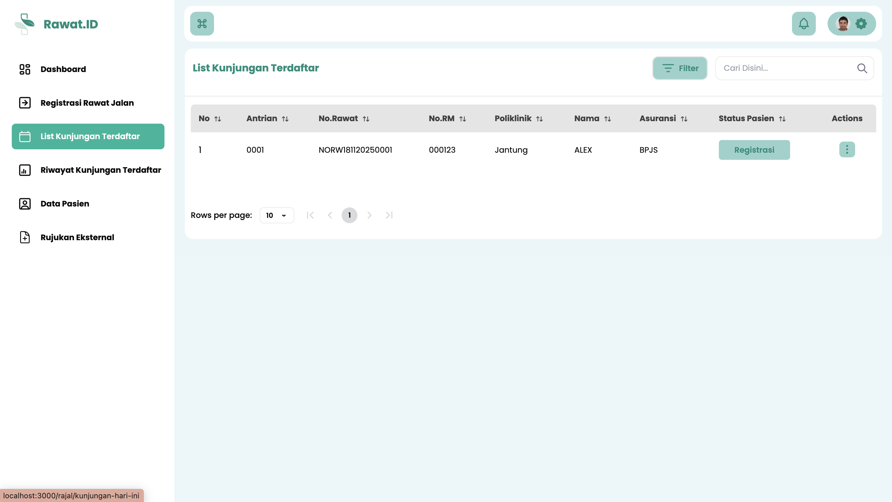
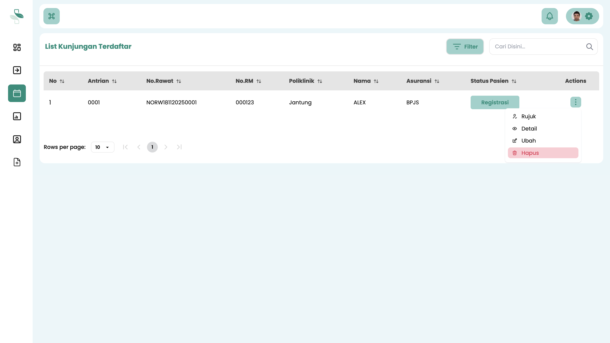

# Hapus Data Kunjungan Pasien

Panduan ini menjelaskan prosedur untuk menghapus data kunjungan pasien yang sudah terdaftar di sistem, jika terjadi kesalahan input.

## Ketentuan untuk Menghapus Data Kunjungan

Untuk menjaga integritas data, sistem memberlakukan aturan ketat terkait menghapus data. Harap pahami kondisi berikut dengan saksama.

### Kapan Data Registrasi Kunjungan Tidak Bisa Dihapus?

Data registrasi kunjungan pasien **tidak dapat dihapus** jika pasien tersebut **sudah ditangani di poli tujuan** atau sudah ada data pelayanan (pemeriksaan, resep, dll.) yang tercatat di dalam sistem.

### Kapan Data Registrasi Kunjungan Bisa Dihapus?

Data registrasi kunjungan pasien **hanya dapat dihapus** jika pasien **belum mendapatkan pelayanan apa pun** di Poliklinik tujuan.

## Langkah-Langkah Menghapus Data Kunjungan

Ikuti langkah-langkah berikut untuk menghapus data kunjungan pasien.

### 1. Akses Menu List Kunjungan Terdaftar

1.  Login ke sistem menggunakan akun **Petugas Pendaftaran**.
2.  Pada menu navigasi utama, pilih **List Kunjungan Terdaftar**.
3.  Anda akan melihat halaman yang berisi daftar semua pasien yang sudah diregistrasi kunjungannya.

### 2. Pilih Aksi "Hapus"

1.  Cari pasien yang datanya akan dihapus pada kunjungannya.
2.  Klik **ikon titik tiga (⋮)** di ujung kanan baris pasien tersebut.
3.  Akan muncul menu pop-up. Pilih tombol **Hapus**.

4.  Tinjau kembali data yang akan dihapus. Jika sudah 100% yakin, klik **Iya** atau **OK** untuk mengonfirmasi dan menghapus data secara permanen.

Setelah dikonfirmasi untuk dihapus, data kunjungan pasien akan langsung dihapus dari sistem.

:::danger Data Tidak Bisa Dipulihkan

**Data yang sudah dihapus tidak dapat dipulihkan kembali.**

Tindakan ini bersifat final. Pastikan Anda telah memverifikasi data dengan benar dan yakin sepenuhnya sebelum melanjutkan proses penghapusan. Kesalahan penghapusan data tidak dapat dibatalkan.

:::
