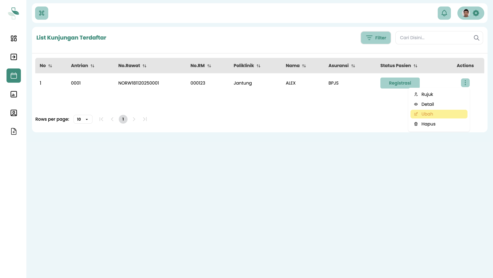
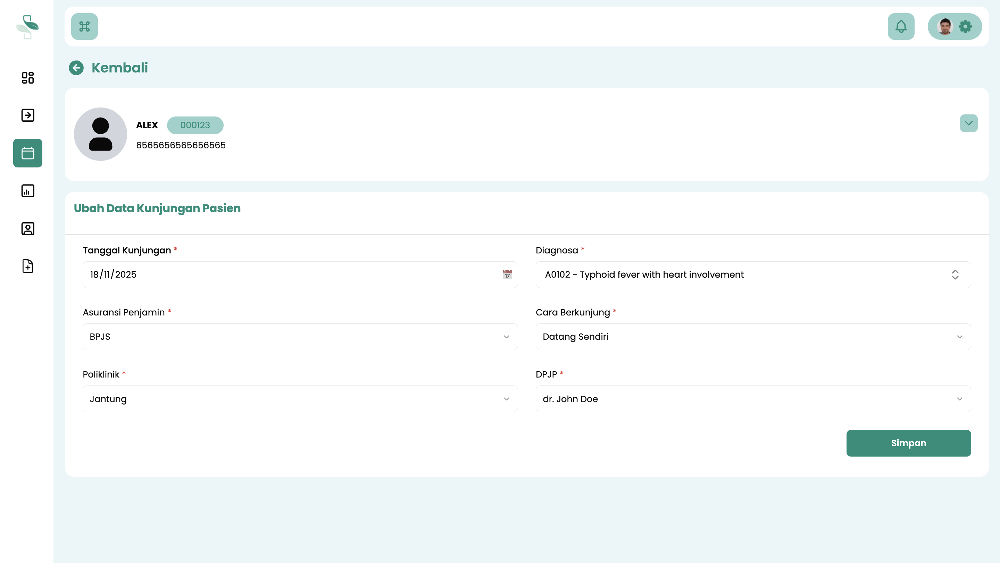

# Mengubah atau Perbaiki Data Kunjungan Pasien

Panduan ini menjelaskan prosedur untuk mengubah atau memperbaiki data kunjungan pasien yang sudah terdaftar di sistem, jika terjadi kesalahan input.

## Ketentuan Pengubahan Data Kunjungan

Untuk menjaga integritas data, sistem memberlakukan aturan ketat terkait pengubahan data. Harap pahami kondisi berikut dengan saksama.

### Kapan Data Registrasi Kunjungan Tidak Bisa Diubah?

Data registrasi kunjungan pasien **tidak dapat diubah** jika pasien tersebut **sudah ditangani di poli tujuan** atau sudah ada data pelayanan (pemeriksaan, resep, dll.) yang tercatat di dalam sistem.

### Kapan Data Registrasi Kunjungan Bisa Diubah?

Data registrasi kunjungan pasien **hanya dapat diubah** jika pasien **belum mendapatkan pelayanan apa pun** di Poliklinik tujuan.

## Langkah-Langkah Mengubah Data Kunjungan

Ikuti langkah-langkah berikut untuk mengubah data kunjungan pasien.

### 1. Akses Menu List Kunjungan Terdaftar

1.  Login ke sistem menggunakan akun **Petugas Pendaftaran**.
2.  Pada menu navigasi utama, pilih **List Kunjungan Terdaftar**.
3.  Anda akan melihat halaman yang berisi daftar semua pasien yang sudah diregistrasi kunjungannya.

### 2. Pilih Aksi "Ubah"

1.  Cari pasien yang datanya akan diubah pada daftar.
2.  Klik **ikon titik tiga (⋮)** di ujung kanan baris pasien tersebut.
3.  Akan muncul menu pop-up. Pilih tombol **Ubah**.

### 3. Edit Formulir dan Simpan Perubahan

1.  Sistem akan menampilkan kembali formulir registrasi kunjungan pasien tersebut.
2.  Lakukan perbaikan pada data yang salah, seperti **Poli Tujuan**, **Dokter Tujuan**, **Waktu Pelayanan**, **Jenis Asuransi**, atau **Diagnosa Awal**.
3.  Setelah selesai, klik tombol **Simpan** untuk menyimpan perubahan.

Setelah disimpan, data kunjungan pasien akan langsung diperbarui di dalam sistem.