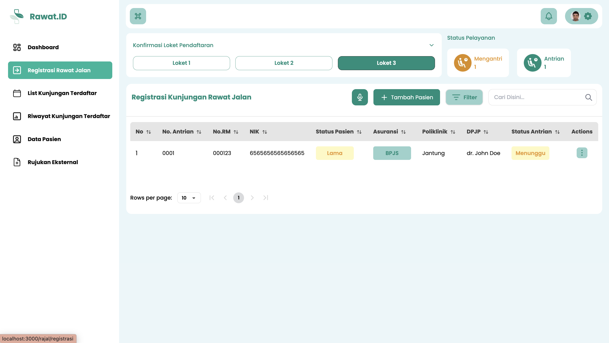
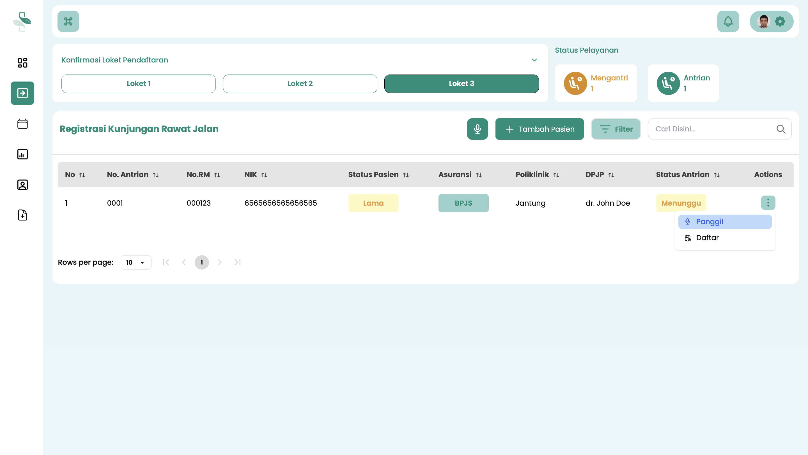
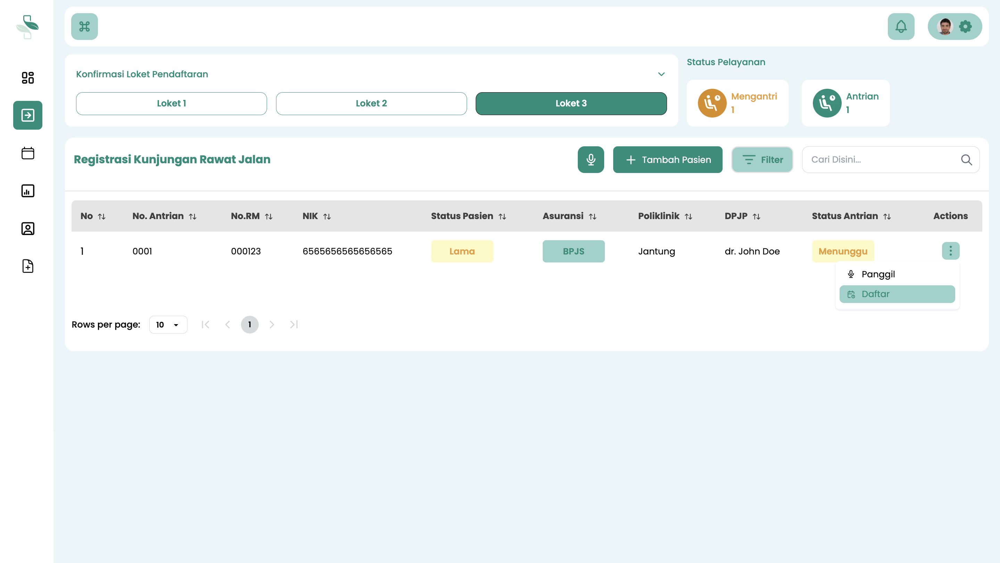
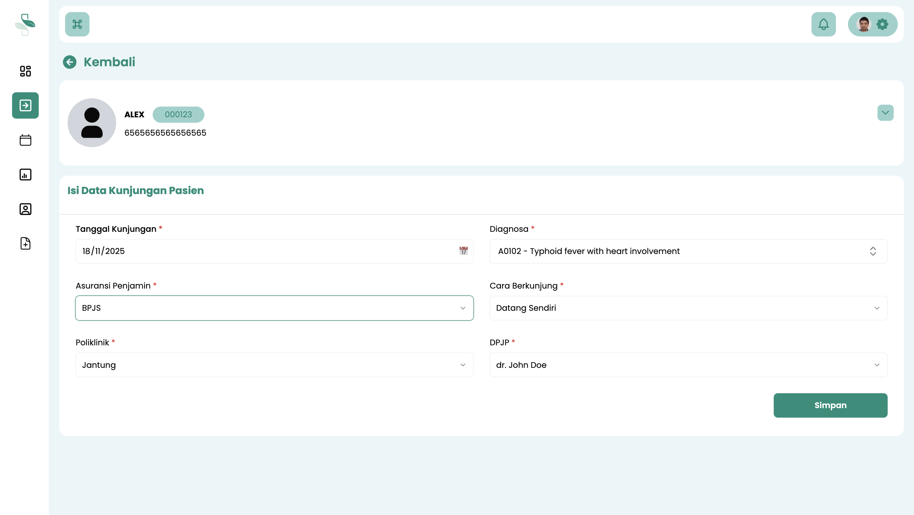
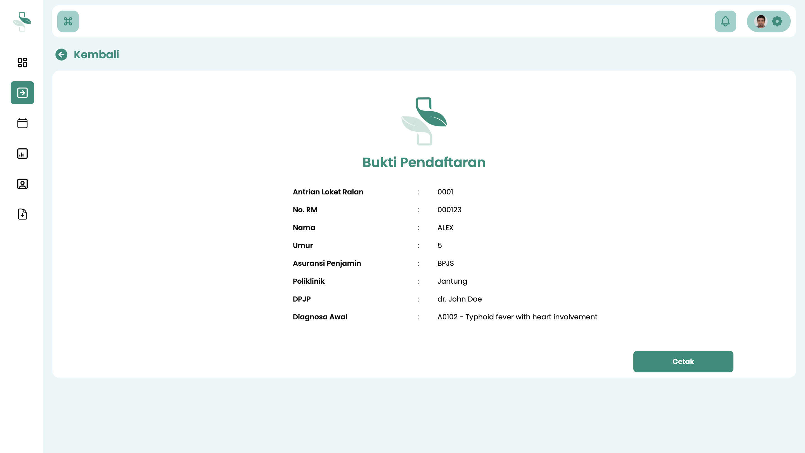
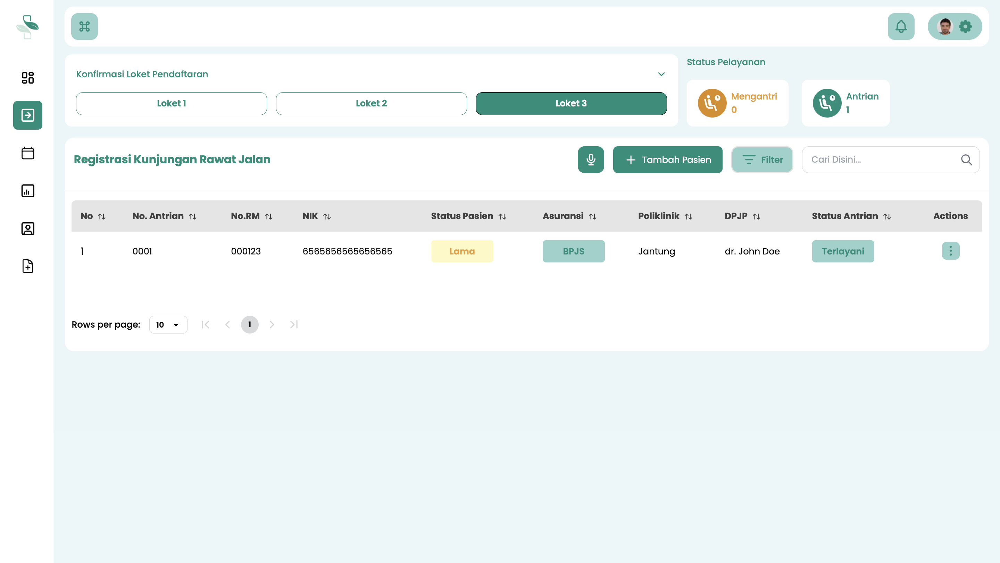

# Registrasi Kunjungan Pasien dari Antrian

Panduan ini menjelaskan alur kerja Petugas Pendaftaran (Admisi) untuk mendaftarkan kunjungan pasien rawat jalan yang telah mengambil nomor antrian.

Proses ini mencakup alur untuk:
* **Pasien Baru** (yang belum memiliki Nomor Rekam Medis)
* **Pasien Lama** (yang sudah memiliki Nomor Rekam Medis)

## Langkah-Langkah Registrasi

Ikuti langkah-langkah berikut untuk mendaftarkan kunjungan pasien dari daftar antrian.

### 1. Akses Menu Registrasi Rawat Jalan

1.  Login ke sistem menggunakan akun **Petugas Pendaftaran**.
2.  Pada menu navigasi utama, pilih **Registrasi Rawat Jalan**.
3.  Anda akan melihat halaman yang berisi daftar pasien yang sudah mengambil nomor antrian.

### 2. Panggil Pasien

1.  Pasien dipanggil satu per satu berdasarkan urutan nomor antrian.
2.  Untuk memanggil pasien berikutnya, klik **ikon titik tiga (⋮)** di ujung kanan baris pasien yang akan dilayani.
3.  Akan muncul menu pop-up. Pilih tombol **Panggil**.

### 3. Mulai Pendaftaran Kunjungan

Setelah pasien datang ke loket dan mengonfirmasi nomor antriannya, klik tombol **Daftar** pada baris pasien tersebut untuk memulai proses registrasi kunjungan.

:::info Penting: Alur Pasien Baru vs. Pasien Lama
Formulir yang akan tampil bergantung pada jenis pasien:

* **Jika Pasien Baru (Belum Memiliki Nomor RM):** Sistem akan menampilkan formulir pendaftaran identitas pasien untuk membuat Nomor Rekam Medis (RM) baru. Lihat Panduan Registrasi Nomor Rekam Medis Pasienuntuk mengetahui lebih lanjut data-data yang perlu diinput ketika registrasi nomor Rekam Medis Pasien baru.
* **Jika Pasien Lama (Sudah Memiliki Nomor RM):** Sistem akan langsung menampilkan formulir registrasi kunjungan, seperti pada langkah berikutnya.
:::

### 4. Lengkapi Formulir Kunjungan Pasien

1.  Isi data kunjungan pasien dengan lengkap, meliputi **Poli Tujuan**, **Dokter Tujuan**, **Waktu Pelayanan**, **Jenis Asuransi**, dan **Diagnosa Awal**.
2.  Setelah semua data terisi, klik tombol **Simpan**.

### 5. Konfirmasi dan Cetak Bukti Registrasi

1.  Setelah pendaftaran berhasil, sistem akan menampilkan jendela konfirmasi **"Bukti Registrasi Kunjungan"**.
2.  Klik **Cetak** untuk mencetak bukti registrasi kunjungan pasien, yang kemudian dapat diserahkan kepada pasien.

### 6. Verifikasi Status Antrian

1.  Kembali ke halaman daftar **Registrasi Rawat Jalan**.
2.  **Status Antrian** untuk pasien yang baru didaftarkan akan otomatis berubah menjadi **Terlayani**.

---

**Langkah Selanjutnya**

Setelah registrasi kunjungan berhasil dan pasien memegang bukti registrasi, arahkan **Pasien** ke Poliklinik tujuan untuk mendapatkan pelayanan medis.