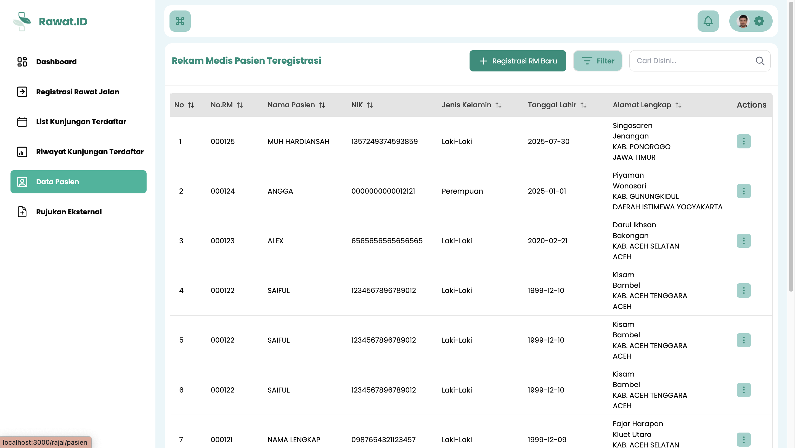
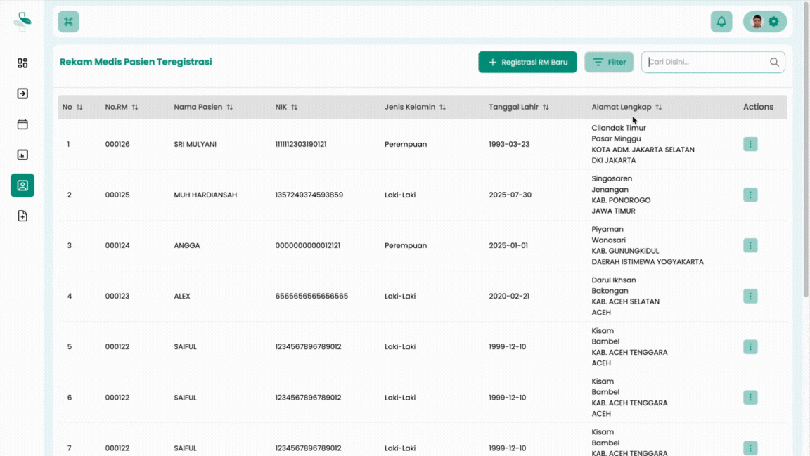
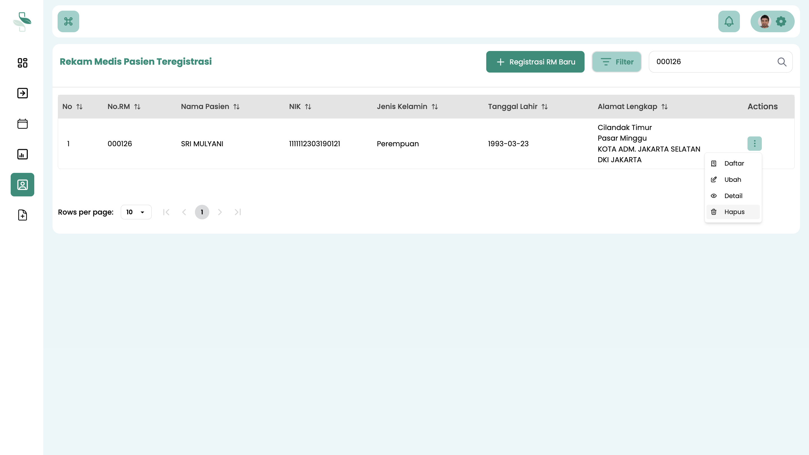
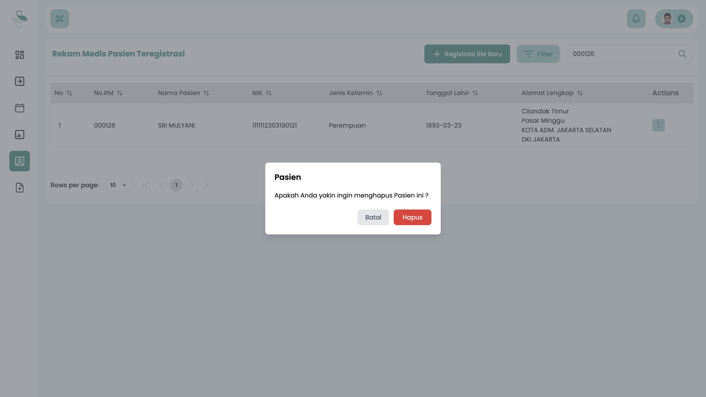

# Hapus Data Pasien Teregistrasi

Panduan ini menjelaskan prosedur untuk menghapus data **pasien yang telah terdaftar di sistem** dan memiliki Nomor Rekam Medis (RM).

Tindakan ini bersifat **permanen** dan merupakan kasus khusus yang jarang dilakukan. Sebelum melanjutkan, sangat penting untuk memahami data pasien mana yang dapat dan tidak dapat dihapus.

## Prasyarat dan Ketentuan Penghapusan

Sistem memberlakukan aturan ketat terkait penghapusan data untuk menjaga integritas riwayat medis. Harap pahami kondisi berikut dengan saksama.

### Kapan Data Pasien Tidak Bisa Dihapus?

Data pasien **tidak dapat dihapus** jika pasien tersebut sudah memiliki **riwayat kunjungan** atau **riwayat pengobatan** yang tercatat di dalam sistem. Data ini wajib dipertahankan untuk kepatuhan dan kesinambungan rekam medis.

### Kapan Data Pasien Bisa Dihapus?

Data pasien **hanya bisa dihapus** jika memenuhi semua kondisi berikut:
* Pasien baru terdaftar (hanya memiliki identitas dan Nomor RM).
* Pasien **belum pernah melakukan kunjungan** sama sekali.
* Pasien **tidak memiliki riwayat pengobatan** atau tindakan medis apa pun yang tercatat.

---

## Langkah-langkah Menghapus Data Pasien

Ikuti langkah-langkah berikut untuk menghapus data pasien yang memenuhi syarat.

### 1. Akses Menu Data Pasien

1.  Pastikan Anda *login* ke sistem menggunakan akun **Petugas Pendaftaran**.
2.  Dari menu navigasi utama, klik **Data Pasien**.

### 2. Temukan Pasien dan Pilih Opsi Hapus

1.  Sistem akan menampilkan tabel yang berisi daftar semua pasien terdaftar.
2.  Gunakan **kolom pencarian** di bagian atas tabel untuk menemukan pasien yang dituju. Pencarian dapat dilakukan berdasarkan **Nomor RM** atau **Nama Pasien**.
3.  Tekan **Enter** untuk memulai pencarian.

4.  Setelah data pasien ditemukan, arahkan kursor ke kolom **Opsi** (kolom paling kanan).
5.  Klik **ikon titik tiga (⋮)** pada baris pasien tersebut untuk membuka menu tindakan.
6.  Pilih opsi **Hapus**.

### 3. Lakukan Konfirmasi Akhir

1.  Sebuah *pop-up* konfirmasi akan muncul untuk memverifikasi tindakan Anda.
2.  Sistem akan bertanya apakah Anda yakin ingin menghapus data pasien tersebut.

3.  Tinjau kembali data yang akan dihapus. Jika sudah 100% yakin, klik **Iya** atau **OK** untuk mengonfirmasi dan menghapus data secara permanen.

:::danger Data Tidak Bisa Dipulihkan

**Data yang sudah dihapus tidak dapat dipulihkan kembali.**

Tindakan ini bersifat final. Pastikan Anda telah memverifikasi data pasien dengan benar dan yakin sepenuhnya sebelum melanjutkan proses penghapusan. Kesalahan penghapusan data tidak dapat dibatalkan.

:::