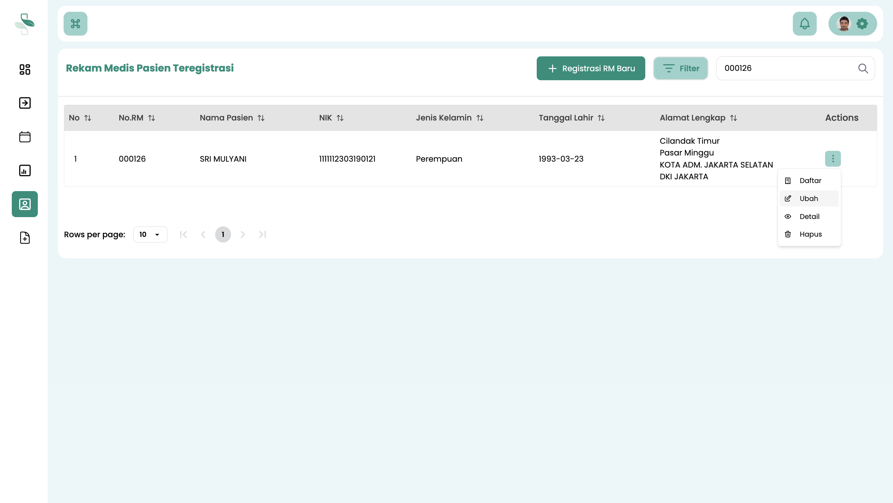
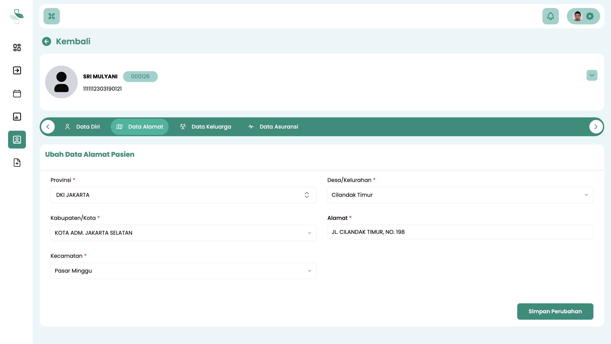

# Perbarui Data Pasien Teregistrasi

Panduan ini menjelaskan proses untuk mengubah atau memperbarui data **pasien yang sudah terdaftar di sistem** dan telah memiliki Nomor Rekam Medis (RM).

Proses ini diperlukan jika terjadi kesalahan input data sebelumnya atau jika ada pembaruan data pasien, seperti perubahan alamat, nomor telepon, status asuransi, atau data penanggung jawab.

:::info Penting: Batasan Perubahan Data

Harap diperhatikan bahwa tidak semua data pasien dapat diubah.

**Nomor Rekam Medis (RM) bersifat permanen** dan akan selalu melekat pada data pasien tersebut. Nomor RM tidak dapat diubah atau diganti.
:::

## Langkah-Langkah Memperbarui Data Pasien

Ikuti langkah-langkah berikut untuk memperbarui data pasien yang telah teregistrasi.

### 1. Akses Menu Data Pasien

1.  Login ke sistem menggunakan akun **Petugas Pendaftaran**.
2.  Pada menu navigasi utama, pilih **Data Pasien**.

### 2. Temukan Pasien dan Pilih Opsi Ubah

1.  Sistem akan menampilkan tabel berisi daftar semua pasien yang terdaftar.
2.  Gunakan **kolom pencarian** di bagian atas tabel untuk menemukan data pasien yang ingin diubah. Anda dapat mencari berdasarkan **Nomor RM** atau **Nama Pasien**. Tekan Enter untuk memulai pencarian.
3.  Setelah data pasien yang dicari muncul di tabel, arahkan ke kolom paling kanan.

4.  Klik tombol **opsi (ikon titik tiga)** pada baris pasien tersebut.
5.  Pilih menu **Ubah** dari opsi yang muncul.

### 3. Lakukan Perubahan Data dan Simpan

1.  Anda akan diarahkan ke halaman formulir data pasien. Halaman ini memiliki beberapa **tab** untuk mengelompokkan informasi:
    * **Data Diri**
    * **Data Alamat**
    * **Data Keluarga**
    * **Data Asuransi**
2.  Pilih tab yang sesuai dengan informasi yang ingin Anda perbarui.
3.  Ubah atau perbaiki data yang diperlukan pada formulir.
4.  Setelah semua perubahan selesai dan dipastikan benar, klik tombol **Simpan** untuk menyimpan pembaruan.

