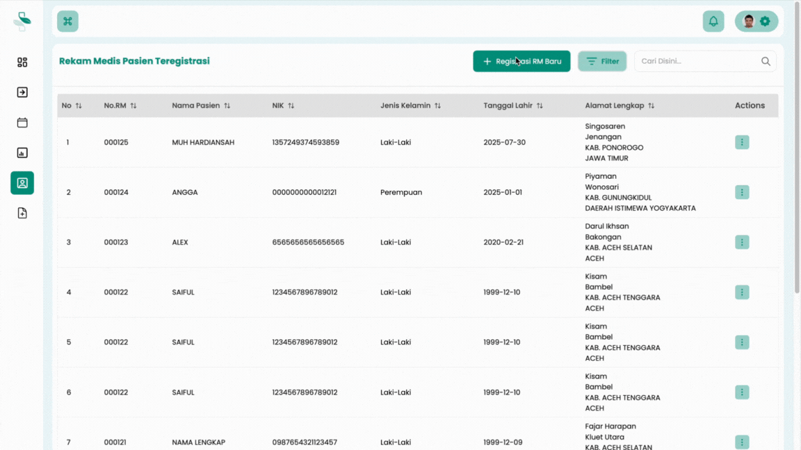
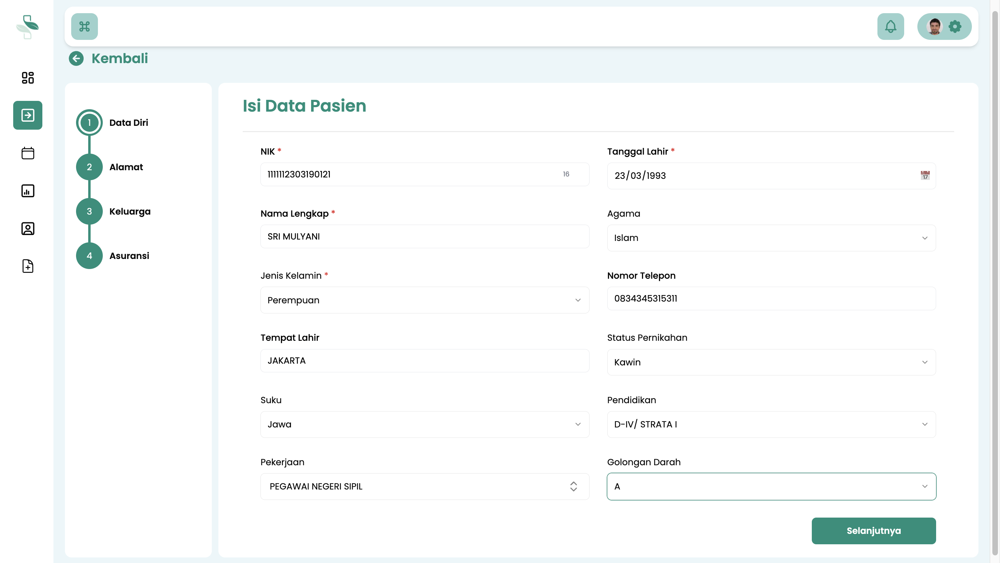
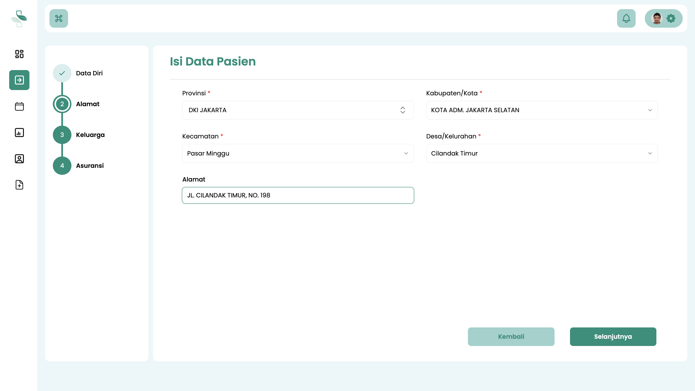
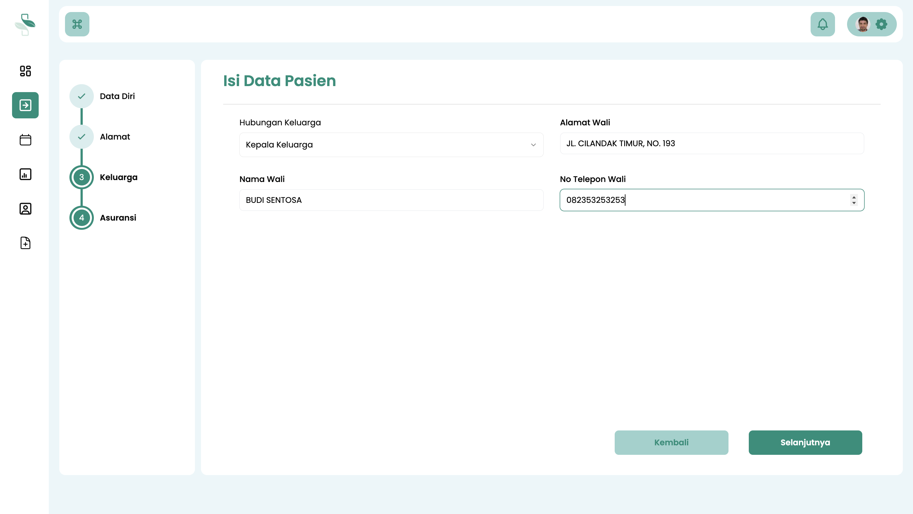
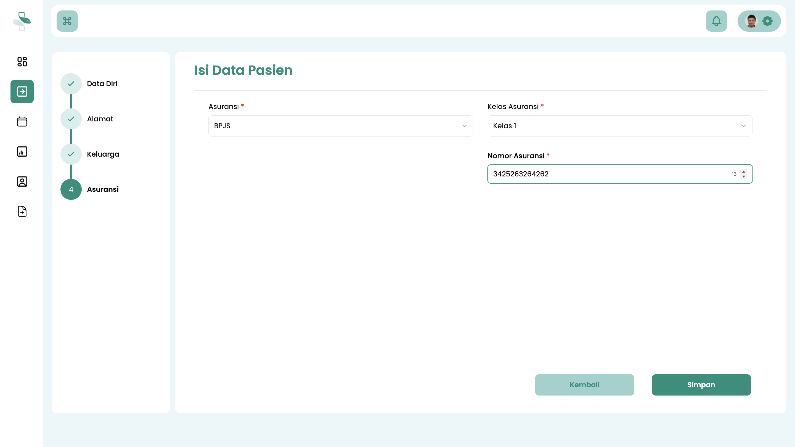
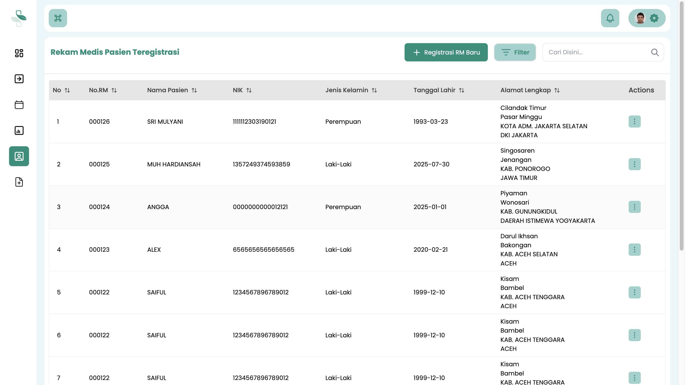

# Registrasi Pasien Baru

Panduan ini menjelaskan proses pendaftaran pasien baru untuk mendapatkan **Nomor Rekam Medis (RM)**.

Setiap pasien yang akan menerima layanan di fasilitas pelayanan kesehatan (fasyankes) Anda, baik itu Rumah Sakit, Klinik, atau Praktik Mandiri, wajib memiliki Nomor RM yang terdaftar di sistem.

Proses ini dilakukan **hanya untuk pasien yang baru pertama kali berkunjung** dan belum pernah terdaftar sebelumnya. Registrasi ini umumnya dilakukan oleh Petugas Admisi atau Petugas Pendaftaran.

:::info Penting: Perbedaan Registrasi Pasien vs. Registrasi Kunjungan

Harap bedakan dua proses yang berbeda ini:

* **Registrasi Pasien Baru (Panduan Ini):** Dilakukan **satu kali saja** untuk pasien yang belum pernah terdaftar. Tujuannya adalah untuk membuat data master pasien dan mendapatkan **Nomor Rekam Medis (RM)**.
* **Registrasi Kunjungan:** Dilakukan **setiap kali** pasien datang untuk berobat atau mendapatkan layanan. Ini adalah proses "check-in" untuk pasien yang *sudah memiliki* Nomor RM.

Jika pasien sudah memiliki Nomor RM, jangan daftarkan sebagai pasien baru. Anda bisa langsung melanjutkan ke proses **Registrasi Kunjungan**.
:::

## Langkah-Langkah Registrasi Pasien Baru

Ikuti langkah-langkah berikut untuk mendaftarkan pasien baru dan menerbitkan Nomor RM.

### 1. Akses Menu Data Pasien

1.  Login ke sistem menggunakan akun **Petugas Pendaftaran**.
2.  Pada menu navigasi utama, pilih **Data Pasien**.

### 2. Mulai Registrasi RM Baru

1.  Anda akan melihat halaman yang berisi tabel daftar semua pasien yang sudah terdaftar di sistem.
2.  Di bagian atas tabel, klik tombol **Registrasi RM Baru**.
3.  Jika muncul menu pop-up, pilih opsi **Registrasi RM Baru**.

### 3. Lengkapi Formulir Data Pasien

Anda akan diarahkan ke halaman formulir pendaftaran yang terdiri dari beberapa tahap. Pastikan semua data diisi dengan lengkap dan benar.

**a. Identitas Diri Pasien**

Isi data diri utama pasien, seperti Nama Lengkap, NIK, Tanggal Lahir, Jenis Kelamin, dan informasi kontak. Setelah selesai, klik **Selanjutnya**.

**b. Alamat Lengkap Pasien**

Lengkapi data alamat domisili pasien secara detail, mulai dari Provinsi, Kabupaten/Kota, Kecamatan, Kelurahan/Desa, hingga alamat lengkap. Setelah selesai, klik **Selanjutnya**.

**c. Data Penanggung Jawab (Wali/Pendamping)**

Masukkan informasi mengenai wali, pendamping, atau penanggung jawab pasien. Data ini penting untuk keperluan kontak darurat atau administrasi. Setelah selesai, klik **Selanjutnya**.

**d. Data Kepesertaan Asuransi**

Pilih skema pembiayaan pasien.

* Jika pasien menggunakan asuransi (misalnya BPJS, Asuransi Swasta), pilih jenis kepesertaan yang sesuai dan lengkapi data yang diminta.
* Jika pasien membayar biaya pengobatan secara pribadi, pilih **Umum/Berobat Mandiri**.

### 4. Simpan Data dan Konfirmasi

1.  Setelah semua data pada formulir dipastikan lengkap dan benar, klik tombol **Simpan**.
2.  Jika muncul pop-up konfirmasi untuk menyelesaikan registrasi, klik **Iya/OK**.

## Hasil dan Langkah Selanjutnya

**Konfirmasi Keberhasilan**

Jika pendaftaran berhasil, data pasien baru akan segera muncul di **Tabel Rekam Medis Pasien Teregistrasi**. Anda akan melihat nama pasien tersebut kini memiliki **Nomor Rekam Medis (RM)** baru yang unik.

**Langkah Selanjutnya**

Setelah data pasien baru tersimpan, Anda dapat melakukan tindakan berikut:

* **Mengubah Data Pasien:** Jika di kemudian hari ada perbaikan atau pembaruan data.
* **Melakukan Registrasi Kunjungan:** Untuk mendaftarkan pasien ke unit layanan (Poliklinik, IGD, Rawat Inap) yang dituju pada kunjungan hari ini.