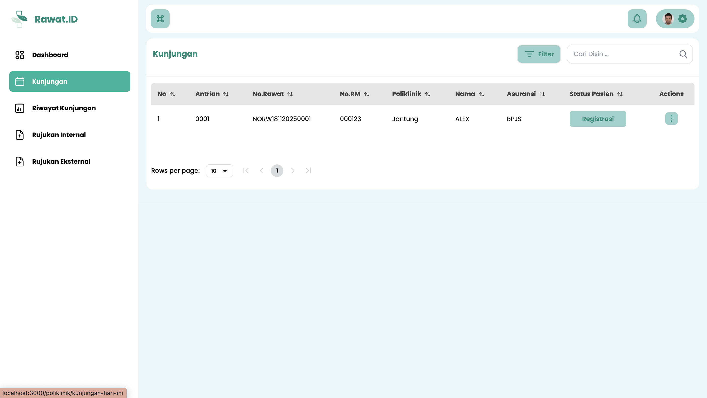
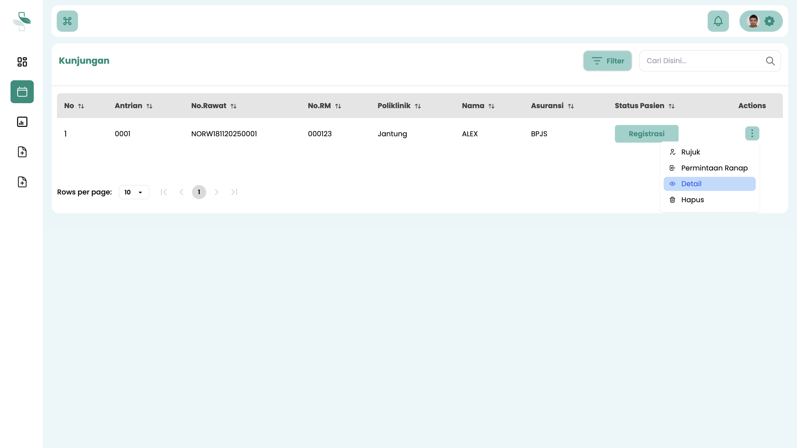
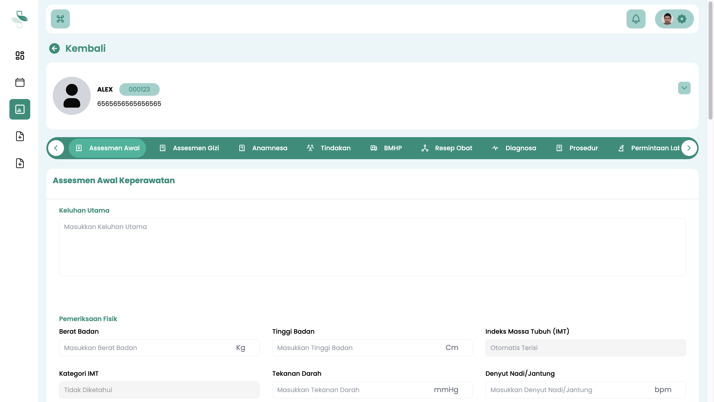

# Penanganan Pasien Rawat Jalan di Poliklinik

Panduan ini menjelaskan proses untuk menginput data pelayanan atau penanganan pasien di Rawat Jalan untuk petugas Poliklinik.

Setelah pasien berhasil diregistrasikan kunjungan oleh **Petugas Pendaftaran**, data Pasien tersebut akan secara otomatis masuk ke modul **Poliklinik** yang digunakan oleh **Petugas Poliklinik**.

**Petugas Poliklinik** bisa login ke sistem Rawat ID untuk menginputkan semua data-data pelayanan yang diberikan kepada pasien.

## Langkah-Langkah Penginputan Data Pelayanan Pasien di Poliklinik

Ikuti langkah-langkah berikut untuk menginput data pelayanan pasien di poliklinik.

### 1. Akses Menu Kunjungan di Modul Poliklinik

1.  Login ke sistem menggunakan akun **Petugas Poliklinik**.
2.  Pada menu navigasi utama, pilih **Kunjungan**.

### 2. Temukan Pasien dan Pilih Opsi Detail

1.  Sistem akan menampilkan tabel berisi daftar semua pasien yang telah teregistrasi kunjungannya.
2.  Gunakan **kolom pencarian** di bagian atas tabel untuk menemukan pasien tersebut. Anda dapat mencari berdasarkan **Nomor RM** atau **Nama Pasien**. 
4.  Klik tombol **opsi (ikon titik tiga)** pada baris pasien tersebut.
5.  Pilih menu **Detail** dari opsi yang muncul.

### 3. Tampilan Penginputan Data Pelayanan Pasien di Poliklinik

Kemudian akan tampil halaman yang berisi berbagai tab untuk menginputkan berbagai data pelayanan Poliklinik seperti pada gambar berikut:

Dari halaman ini **Petugas Poliklinik** bisa menginputkan berbagai data pelayanan yang didapatkan oleh Pasien di Poliklinik, seperti Asesmen Awal Keperawatan, Asesmen Gizi, Anamnesa, Tindakan Medis, Penggunaan BMHP (Bahan Medis Habis Pakai), Resep Obat, Pengegakan Diagnosa, Permintaan Lab serta Permintaan Radiologi.

:::tip Panduan Penginputan Setiap Data

Untuk mengikuti panduan penginputan data dari masing-masing jenis leyanan tersebut, kamu melihat pada panduan Poliklinik. Pilih panduan yang sesuai dengan data yang kamu inginkan.

:::